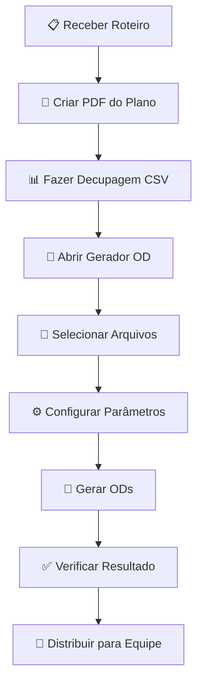

# Manual do Usuário - Ordem do Dia

## 📖 Guia Completo de Utilização

### 🎯 O que é o Ordem do Dia?

O **Ordem do Dia** é um software profissional que automatiza a criação de planilhas organizacionais para produções audiovisuais. Ele processa documentos PDF e planilhas CSV para gerar Ordens do Dia (ODs) formatadas e prontas para distribuição às equipes de filmagem.

### 📋 Requisitos do Sistema

- **Sistema Operacional**: Windows 10 ou superior
- **Memória RAM**: Mínimo 4GB (recomendado 8GB)
- **Espaço em Disco**: 500MB livres
- **Resolução**: Mínimo 1024x768

### 🚀 Instalação e Primeiro Uso

#### Método 1: Executável Standalone (Recomendado)

1. **Download**: Baixe o arquivo `GeradorOD.exe` da página de releases
2. **Criação de Pasta**: Crie uma pasta dedicada no seu computador (ex: `C:\OrdemDoDia`)
3. **Extração**: Extraia todos os arquivos da distribuição nesta pasta
4. **Execução**: Clique duas vezes em `GeradorOD.exe`

```
📁 OrdemDoDia/
├── 🔧 GeradorOD.exe              # Executável principal
├── ⚙️ config_dias_filmagem.json  # Configurações
├── 📖 README.txt                 # Este manual
├── 📁 arquivos/                  # Pasta de trabalho
    ├── 📄 DECUPAGEM.csv          # Exemplo de CSV
    ├── 📄 PLANO_FINAL.pdf        # Exemplo de PDF
    └── 📁 ODs/                   # Planilhas geradas
```

#### Método 2: Código Fonte (Para Desenvolvedores)

```bash
# Clone o repositório
git clone https://github.com/seu-usuario/automatiza-od.git
cd automatiza-od

# Configure o ambiente Python
python -m venv .venv
.venv\Scripts\activate

# Instale dependências
pip install -r requirements.txt

# Execute o programa
python gerar_od.py
```

### 🎮 Interface do Programa

#### Tela Principal


1. **📁 Seleção de Arquivos**
   - **Arquivo PDF**: Documento com informações de produção
   - **Arquivo CSV**: Planilha com decupagem das cenas

2. **⚙️ Configurações**
   - **Número de Dias**: Quantos dias de filmagem processar
   - **Opções Avançadas**: Configurações adicionais

3. **🎯 Controles de Execução**
   - **Gerar OD**: Processa os arquivos selecionados
   - **Gerar Todas as ODs**: Processa todos os dias automaticamente
   - **Limpar**: Reset dos campos

4. **📊 Área de Status**
   - **Log de Progresso**: Mostra o andamento das operações
   - **Barra de Progresso**: Indicador visual do processamento

#### Códigos de Cor da Interface

- **🔵 Azul**: Elementos principais e botões ativos
- **🟢 Verde**: Operações concluídas com sucesso
- **🔴 Vermelho**: Erros e problemas detectados
- **🟡 Amarelo**: Avisos e informações importantes
- **⚫ Cinza**: Elementos desabilitados ou inativos

### 📄 Preparação dos Arquivos

#### Arquivo PDF (Plano de Filmagem)

O PDF deve conter informações estruturadas sobre a produção:

```
📋 Conteúdo Esperado:
├── Informações da Produção
│   ├── Nome do projeto
│   ├── Diretor
│   ├── Produtor
│   └── Data de filmagem
├── Cronograma de Filmagem
│   ├── Dia 1: [Data] - [Locação]
│   ├── Dia 2: [Data] - [Locação]
│   └── ...
└── Detalhes das Cenas
    ├── Número da cena
    ├── Descrição
    ├── Personagens
    └── Observações
```

**Exemplo de formato reconhecido:**
```
CRONOGRAMA DE FILMAGEM

Dia 1 - 15/03/2024 - Locação: Escritório Central
Cenas: 1, 3, 7
Personagens: Ana, Carlos, Marina

Dia 2 - 16/03/2024 - Locação: Café Downtown  
Cenas: 2, 4, 5
Personagens: Ana, João
```

#### Arquivo CSV (Decupagem)

A planilha CSV deve ter a seguinte estrutura:

| Coluna | Descrição | Obrigatória | Exemplo |
|--------|-----------|-------------|---------|
| `CENA` | Número da cena | ✅ Sim | 1, 2, 3A |
| `DESCRICAO` | Descrição da cena | ✅ Sim | "João entra no escritório" |
| `LOCACAO` | Local de filmagem | ✅ Sim | "Escritório Central" |
| `PERSONAGENS` | Elenco da cena | ✅ Sim | "Ana, Carlos" |
| `TEMPO_ESTIMADO` | Duração estimada | ❌ Não | "15 min" |
| `OBSERVACOES` | Notas adicionais | ❌ Não | "Usar steadicam" |
| `EQUIPAMENTOS` | Material necessário | ❌ Não | "Tripé, microfone" |

**Exemplo de CSV válido:**
```csv
CENA,DESCRICAO,LOCACAO,PERSONAGENS,TEMPO_ESTIMADO,OBSERVACOES
1,"Ana chega ao escritório","Escritório Central","Ana, Recepcionista","10 min","Plano sequência"
2,"Reunião de equipe","Sala de Reuniões","Ana, Carlos, Marina","20 min","Mesa redonda"
3,"João sai do prédio","Entrada Principal","João","5 min","Plano externo"
```

### ⚙️ Configuração Avançada

#### Arquivo de Configuração (config_dias_filmagem.json)

```json
{
  "dias_filmagem": {
    "total_dias": 5,
    "formato_data": "dd/mm/yyyy",
    "locacoes_padrao": ["Estúdio A", "Locação Externa"],
    "horario_chamada": "07:00",
    "horario_wrap": "19:00"
  },
  "formatacao_excel": {
    "fonte_cabecalho": "Arial Black",
    "tamanho_fonte": 12,
    "cores": {
      "cabecalho": "#4472C4",
      "linha_par": "#F2F2F2",
      "linha_impar": "#FFFFFF"
    }
  },
  "validacao": {
    "verificar_cenas_duplicadas": true,
    "validar_personagens": true,
    "alerta_tempo_excedido": true
  }
}
```

#### Personalização de Cores e Fontes

Para modificar a aparência das planilhas geradas, edite o arquivo de configuração:

```json
"formatacao_excel": {
  "fonte_cabecalho": "Calibri Bold",
  "tamanho_fonte": 11,
  "cores": {
    "cabecalho": "#2E75B6",        // Azul escuro
    "destaque": "#FFC000",         // Amarelo
    "linha_par": "#E7E6E6",        // Cinza claro
    "linha_impar": "#FFFFFF",      // Branco
    "borda": "#595959"             // Cinza escuro
  }
}
```

### 🔄 Fluxo de Trabalho Típico

#### Processo Completo: Do Planejamento à Distribuição



#### Exemplo Prático: Série de 5 Episódios

**Passo 1: Preparação**
```
📁 Projeto_Serie_Drama/
├── 📄 Episodio_01_Plano.pdf
├── 📊 Episodio_01_Decupagem.csv
├── 📄 Episodio_02_Plano.pdf
├── 📊 Episodio_02_Decupagem.csv
└── ...
```

**Passo 2: Configuração**
- Total de dias: 15 (3 dias por episódio)
- Formato de data: DD/MM/YYYY
- Horários: Chamada 07:00, Wrap 19:00

**Passo 3: Execução**
1. Abrir `GeradorOD.exe`
2. Selecionar `Episodio_01_Plano.pdf`
3. Selecionar `Episodio_01_Decupagem.csv`
4. Configurar para 3 dias
5. Clicar "Gerar Todas as ODs"

**Passo 4: Resultado**
```
📁 ODs/
├── 📊 OD_Dia_1.xlsx
├── 📊 OD_Dia_2.xlsx
└── 📊 OD_Dia_3.xlsx
```

### 📊 Interpretação dos Resultados

#### Estrutura da Planilha Gerada

Cada arquivo Excel contém as seguintes abas:

1. **📋 Ordem do Dia**
   - Cronograma detalhado do dia
   - Lista de cenas a filmar
   - Chamada de elenco e equipe

2. **🎭 Elenco**
   - Lista de atores necessários
   - Horários de chamada individuais
   - Personagens por cena

3. **🎬 Equipamentos**
   - Material necessário
   - Responsáveis por equipamento
   - Checklist de preparação

4. **📍 Locações**
   - Endereços e contatos
   - Informações logísticas
   - Mapas e referências

#### Exemplo de OD Gerada

```
📊 ORDEM DO DIA - DIA 1
📅 Data: 15/03/2024
📍 Locação Principal: Escritório Central
⏰ Chamada Geral: 07:00

┌─────────────────────────────────────────┐
│           CRONOGRAMA DO DIA             │
├─────────────────────────────────────────┤
│ 07:00 - Chegada da equipe              │
│ 07:30 - Reunião de produção            │
│ 08:00 - Setup equipamentos             │
│ 09:00 - CENA 1 - Ana chega              │
│ 10:30 - CENA 3 - Reunião de equipe     │
│ 12:00 - ALMOÇO                         │
│ 13:00 - CENA 7 - João sai              │
│ 15:00 - Wrap e desmontagem             │
└─────────────────────────────────────────┘
```

### 🔍 Solução de Problemas

#### Problemas Comuns e Soluções

**❌ Erro: "Arquivo PDF não encontrado"**
```
🔍 Causa: Caminho do arquivo está incorreto
✅ Solução: 
   1. Verificar se o arquivo existe
   2. Usar "Procurar" para selecionar
   3. Evitar caracteres especiais no nome
```

**❌ Erro: "CSV mal formatado"**
```
🔍 Causa: Planilha não tem as colunas obrigatórias
✅ Solução:
   1. Verificar colunas: CENA, DESCRICAO, LOCACAO, PERSONAGENS
   2. Salvar como CSV com codificação UTF-8
   3. Remover linhas vazias no final
```

**❌ Erro: "Não foi possível gerar Excel"**
```
🔍 Causa: Arquivo Excel está aberto em outro programa
✅ Solução:
   1. Fechar Excel ou outros editores
   2. Verificar permissões da pasta
   3. Tentar executar como administrador
```

**❌ Interface aparece "cortada" ou pequena**
```
🔍 Causa: Configurações de DPI/escala do Windows
✅ Solução:
   1. Clicar direito no GeradorOD.exe
   2. Propriedades > Compatibilidade
   3. Marcar "Substituir comportamento de dimensionamento"
   4. Selecionar "Aplicativo"
```

#### Logs e Diagnóstico

O programa gera logs detalhados na área de status. Para diagnóstico avançado:

**Ativar modo debug:**
1. Abrir prompt de comando como administrador
2. Navegar até a pasta do programa
3. Executar: `GeradorOD.exe --debug`

**Interpretar mensagens de log:**
- `🚀` Início de operação
- `✅` Sucesso
- `❌` Erro crítico
- `⚠️` Aviso (não bloqueia)
- `📊` Informação estatística

### 🎯 Dicas de Melhores Práticas

#### Organização de Arquivos

```
📁 Projeto_MeuFilme/
├── 📁 01_Preparacao/
│   ├── roteiro_final.pdf
│   └── decupagem_master.csv
├── 📁 02_Ods_Geradas/
│   ├── OD_Dia_1.xlsx
│   ├── OD_Dia_2.xlsx
│   └── ...
├── 📁 03_Distribuicao/
│   ├── WhatsApp_Elenco/
│   ├── Email_Equipe/
│   └── Impressos/
└── 📁 04_Alteracoes/
    ├── versao_1.1/
    └── versao_1.2/
```

#### Versionamento das ODs

- **Versão 1.0**: OD inicial
- **Versão 1.1**: Pequenas correções
- **Versão 2.0**: Mudanças significativas
- **Versão FINAL**: Versão para filmagem

#### Checklist Pré-Distribuição

- [ ] ✅ Todas as cenas do dia estão listadas
- [ ] ✅ Horários de chamada estão corretos
- [ ] ✅ Locações têm endereços completos
- [ ] ✅ Lista de equipamentos está completa
- [ ] ✅ Contatos de emergência incluídos
- [ ] ✅ Informações meteorológicas verificadas
- [ ] ✅ Backup da OD criado

### 📞 Suporte e Contato

#### Canais de Suporte

- **📧 Email**: suporte@ordemdodia.com
- **💬 Discord**: [Comunidade Ordem do Dia](https://discord.gg/ordemdodia)
- **🐛 Bug Reports**: [GitHub Issues](https://github.com/usuario/automatiza-od/issues)
- **📖 Documentação**: [Wiki Oficial](https://github.com/usuario/automatiza-od/wiki)

#### FAQ - Perguntas Frequentes

**P: Posso usar o programa em Mac ou Linux?**
R: Atualmente apenas Windows. Versões para outros sistemas estão em desenvolvimento.

**P: Há limite de cenas ou dias que posso processar?**
R: Não há limite técnico. O programa foi testado com projetos de até 50 dias de filmagem.

**P: Posso customizar o formato das planilhas?**
R: Sim, através do arquivo `config_dias_filmagem.json` você pode personalizar cores, fontes e layout.

**P: O programa funciona offline?**
R: Sim, é completamente offline. Não requer conexão com internet.

**P: Como faço backup das configurações?**
R: Copie o arquivo `config_dias_filmagem.json` para um local seguro.

### 📈 Roadmap e Atualizações

#### Próximas Funcionalidades

- **🌐 Versão Web**: Interface online para equipes remotas
- **📱 App Mobile**: Visualização em smartphones e tablets
- **🔗 Integração**: Conexão com softwares de produção populares
- **🤖 IA**: Sugestões automáticas de cronograma
- **☁️ Cloud**: Sincronização na nuvem
- **📊 Relatórios**: Analytics de produção

#### Histórico de Versões

- **v1.0.0** (2024-01): Versão inicial
- **v1.1.0** (2024-02): Interface melhorada
- **v1.2.0** (2024-03): Acessibilidade WCAG 2.1
- **v1.3.0** (2024-04): Configurações avançadas

### 📜 Licença e Termos de Uso

Este software é fornecido "como está", sem garantias. Consulte o arquivo LICENSE para detalhes completos da licença.

---

**📞 Precisa de ajuda?** 
Entre em contato através dos canais de suporte ou consulte a documentação online completa.

**🎬 Boas filmagens!**
